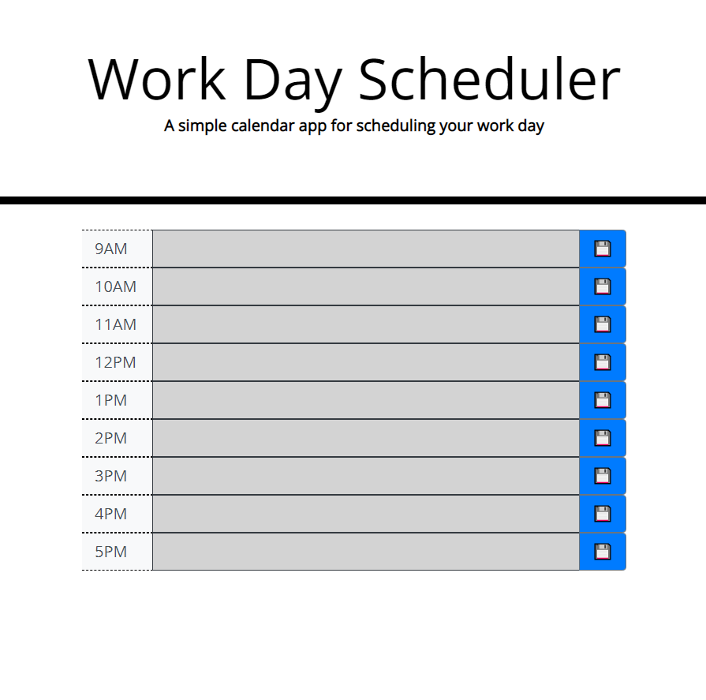

# work-day-scheduler
## Description
- This website allows you to plan your workday to allow for greater effectiveness and readiness! 
- Not only will this website display the current time/day, but it will ALSO show you where in the day you are indicated by the different colored boxes (gray for past, red for present, green for future!)
    - Step 1: click in the text field for the day you wish to add content
    - Step 2: hit the save button indicated by the floppy disk emoji
    - Step 3: your changes are saved! now, when you come back to the page, you will find that your whole planned workday is still there!
- if you wish to change something in a specific field, simply click on that field and start typing!

## Live Site: 
https://specsnstats.github.io/work-day-scheduler/

## Repository: 
https://github.com/specsnstats/work-day-scheduler

## Credits: 
Jonathan Newman with the help of my teacher, teachers assistants, and study group. 
